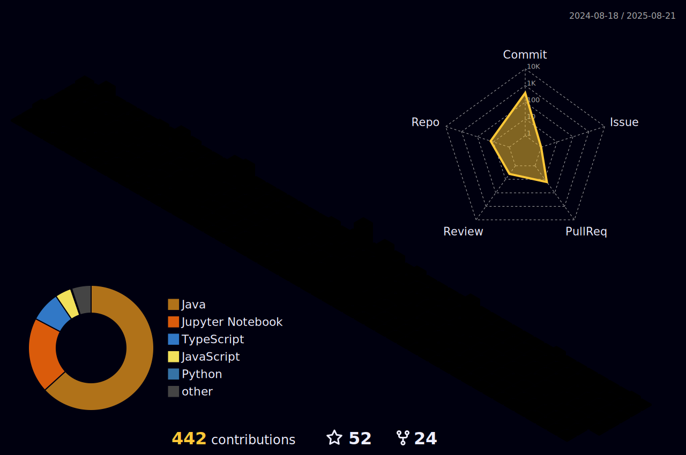

<h2 align="center">Deep Learning Engineer and a Full Stack Web Developer from India ❤️</h1>

</h2>

  

- 🎓 Graduated : **B. Tech in CSE**.

- ⚡ I love playing video games, guitar, loves to travel, machine learning and programming.

- ## Workspace Specs:
  

  

  <h2> <strong> Actively Learning: </strong></h2>

 

 

   

